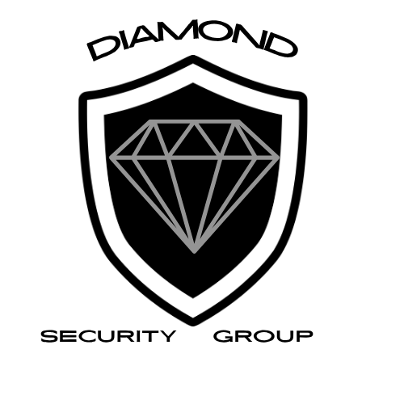

<!DOCTYPE html>
<html lang="en">
<head>
<meta charset="UTF-8">
<meta name="viewport" content="width=device-width, initial-scale=1.0">
<title>Diamond Security Group LLC — Syracuse, NY</title>
<meta name="description" content="Diamond Security Group LLC — founded by Syracuse Police Department officers. Site assessments, licensed guard training, and on-site security for residential, commercial, and event venues.">
<link rel="preconnect" href="https://fonts.googleapis.com">
<link rel="preconnect" href="https://fonts.gstatic.com" crossorigin>
<link href="https://fonts.googleapis.com/css2?family=Oswald:wght@500;600;700&family=Inter:wght@400;500;600&family=JetBrains+Mono:wght@500;600&display=swap" rel="stylesheet">
<link rel="stylesheet" href="styles.css">
</head>
<body>

<header>
  

    <a href="#top" class="brand">
      
      Diamond Security GroupLLC · SYRACUSE, NY
    </a>
    <nav class="links">
      <a href="#about">About</a>
      <a href="#services">Services</a>
      <a href="#why">Credentials</a>
      <a href="#contact">Contact</a>
    </nav>
    <a href="#contact" class="nav-cta">Request Consultation</a>
  

</header>

<main id="top">

  <section class="hero on-dark">
    

    

      

        
Founded by Syracuse Police Department Officers

        <h1>Security built by people who have <em>answered the call.</em></h1>
        
Diamond Security Group LLC is a fully insured security company led by active-duty and veteran law enforcement and military professionals — providing threat assessments, licensed guard training, and on-site security for residential, commercial, and special events.

        

          <a href="#contact" class="btn btn-primary">Request a Consultation</a>
          <a href="#services" class="btn btn-ghost">View Services</a>
        

        

          
<strong>Fully Insured</strong>Licensed &amp; bonded operation

          
<strong>In-House Training</strong>Own certification division

          
<strong>Armed &amp; Unarmed</strong>Uniformed and plain clothes

        

      

      

        <svg viewBox="0 0 300 340" xmlns="http://www.w3.org/2000/svg">
          <polygon points="150,4 292,60 292,180 150,336 8,180 8,60" fill="none" stroke="#8A93A3" stroke-width="1.4" opacity="0.55"/>
          <polygon points="150,4 292,60 150,120 8,60" fill="#1A1F27" stroke="#D98E2C" stroke-width="1" opacity="0.9"/>
          <polygon points="8,60 150,120 150,336 8,180" fill="#161B22" stroke="#8A93A3" stroke-width="1" opacity="0.85"/>
          <polygon points="292,60 292,180 150,336 150,120" fill="#20262F" stroke="#8A93A3" stroke-width="1" opacity="0.85"/>
          <polygon points="60,60 150,90 240,60 150,30" fill="none" stroke="#D98E2C" stroke-width="1" opacity="0.7"/>
          <polygon points="150,90 60,60 150,336 240,60" fill="none" stroke="#CBD8E3" stroke-width="0.8" opacity="0.35"/>
          <g id="glint">
            <polygon points="150,4 292,60 150,120 8,60" fill="#D98E2C" opacity="0.16"/>
          </g>
        </svg>
      

    

  </section>

  <section class="about" id="about">
    

      

        
About Us

        <h2 class="section-head-h">Career officers, not contract guards.</h2>
        

          
Diamond Security Group LLC was founded by two active members of the Syracuse Police Department who have served as Community Service Officers and worked in the security field for many years. Our leadership brings real-world law enforcement experience directly to your security needs.

          
All of our trainers and management personnel are current or former law enforcement officers or military veterans. That experience includes overseas service in high-threat environments, high-risk call response, and specialized security operations. We don't hire security guards—we deploy trained law enforcement professionals.

        

      

      

        

          <h3>PD</h3>
          
Founded by Syracuse Police officers

        

        

          <h3>100%</h3>
          
Fully insured operation

        

        

          <h3>In-House</h3>
          
Own training &amp; certification division

        

        

          <h3>Mil / LE</h3>
          
Executive team background

        

      

    

  </section>

  <section class="services" id="services">
    

      

        
Our Services

        <h2>Meeting all of your training and security needs.</h2>
        
From evaluating a site's vulnerabilities to standing post on the ground, our services cover the full lifecycle of a security program.

      

      

        

          <svg class="service-icon" viewBox="0 0 44 44" fill="none" xmlns="http://www.w3.org/2000/svg">
            <path d="M22 4 L38 11 V22 C38 31 31 37 22 40 C13 37 6 31 6 22 V11 Z" stroke="#D98E2C" stroke-width="1.6"/>
            <path d="M15 22 L20 27 L30 16" stroke="#F5F3EE" stroke-width="1.6" stroke-linecap="round" stroke-linejoin="round"/>
          </svg>
          <h3>Site &amp; Threat Assessments</h3>
          <ul>
            <li>Residential</li>
            <li>Commercial / Industrial</li>
            <li>Events &amp; Conferences</li>
            <li>Hotels / Hospitality</li>
          </ul>
        

        

          <svg class="service-icon" viewBox="0 0 44 44" fill="none" xmlns="http://www.w3.org/2000/svg">
            <circle cx="22" cy="14" r="7" stroke="#D98E2C" stroke-width="1.6"/>
            <path d="M8 39 C8 29 14.5 24 22 24 C29.5 24 36 29 36 39" stroke="#F5F3EE" stroke-width="1.6" stroke-linecap="round"/>
          </svg>
          <h3>Training &amp; Certification</h3>
          <ul>
            <li>Annual Security Guard Course</li>
            <li>Armed Security Guard Course</li>
            <li>De-escalation Tactics</li>
            <li>Defensive Tactics</li>
            <li>CPR / First Aid</li>
            <li>Active Shooter Training</li>
          </ul>
        

        

          <svg class="service-icon" viewBox="0 0 44 44" fill="none" xmlns="http://www.w3.org/2000/svg">
            <rect x="8" y="18" width="28" height="14" rx="2" stroke="#D98E2C" stroke-width="1.6"/>
            <path d="M13 18 L16 10 H28 L31 18" stroke="#F5F3EE" stroke-width="1.6" stroke-linejoin="round"/>
            <circle cx="15" cy="32" r="2.4" fill="#F5F3EE"/>
            <circle cx="29" cy="32" r="2.4" fill="#F5F3EE"/>
          </svg>
          <h3>On-Site Security</h3>
          <ul>
            <li>Uniformed Security (Armed &amp; Unarmed)</li>
            <li>Plain Clothes Security</li>
            <li>Car Patrol</li>
            <li>Executive Protection</li>
            <li>Loss Prevention</li>
            <li>Event Security</li>
          </ul>
        

      

    

  </section>

  <section class="why" id="why">
    

      

        <svg viewBox="0 0 200 200" xmlns="http://www.w3.org/2000/svg">
          <polygon points="100,10 180,55 180,145 100,190 20,145 20,55" fill="none" stroke="#8A93A3" stroke-width="1.2" opacity="0.6"/>
          <polygon points="100,10 180,55 100,100 20,55" fill="#20262F" stroke="#D98E2C" opacity="0.9"/>
          <polygon points="20,55 100,100 100,190 20,145" fill="#161B22"/>
          <polygon points="180,55 180,145 100,190 100,100" fill="#2A313C"/>
          <polygon points="60,55 100,75 140,55 100,35" fill="none" stroke="#D98E2C" stroke-width="1" opacity="0.75"/>
        </svg>
      

      

        
Why Diamond

        <h2 style="margin-top:0.8rem;">Every credential on our roster was earned on duty.</h2>
        

          

            01
            

              <h4>Law Enforcement Leadership</h4>
              
Founded by active Syracuse Police Department Community Service Officers with years of hands-on security experience.

            

          

          

            02
            

              <h4>Veteran &amp; Military-Trained Staff</h4>
              
Trainers and management are current or former law enforcement officers or military veterans, including overseas service in high-threat environments.

            

          

          

            03
            

              <h4>Real-World, High-Risk Experience</h4>
              
Our team has handled high-risk calls for service in local communities and provided high-threat security details at special events.

            

          

          

            04
            

              <h4>Our Own Training Division</h4>
              
An in-house training division means every officer is certified and held to the same standard, from onboarding through active deployment.

            

          

        

      

    

  </section>

  <section class="contact" id="contact">
    

      

        
Get In Touch

        <h2 style="margin-top:0.8rem; color:var(--bone);">Let's talk about securing your site.</h2>
        
Tell us about your property or event and a member of our team will follow up to schedule a site assessment.

        

          

            <strong>Phone</strong>
            [Add phone number]
          

        

        

          

            <strong>Email</strong>
            [Add email address]
          

        

        

          

            <strong>Service Area</strong>
            Syracuse, NY &amp; Central New York
          

        

      

      <form id="quoteForm">
        

          

            <label for="name">Full Name</label>
            <input type="text" id="name" name="name" required>
          

          

            <label for="phone">Phone</label>
            <input type="tel" id="phone" name="phone" required>
          

        

        

          <label for="email">Email</label>
          <input type="email" id="email" name="email" required>
        

        

          <label for="service">Service Needed</label>
          <select id="service" name="service">
            <option>Site / Threat Assessment</option>
            <option>On-Site Security (Armed)</option>
            <option>On-Site Security (Unarmed)</option>
            <option>Event Security</option>
            <option>Executive Protection</option>
            <option>Guard Training &amp; Certification</option>
            <option>Other</option>
          </select>
        

        

          <label for="message">Details</label>
          <textarea id="message" name="message" rows="4" placeholder="Property type, location, dates, or anything else we should know"></textarea>
        

        <button type="submit" class="submit-btn">Send Request</button>
        
This form is a front-end template — connect it to an email service or backend before going live.

      </form>
    

  </section>

</main>

<footer>
  

    

      

        
        Diamond Security Group LLC
      

      

        <a href="#about">About</a>
        <a href="#services">Services</a>
        <a href="#why">Credentials</a>
        <a href="#contact">Contact</a>
      

    

    
©  Diamond Security Group LLC. Fully insured. Syracuse, NY.

  

</footer>

</body>
</html>
